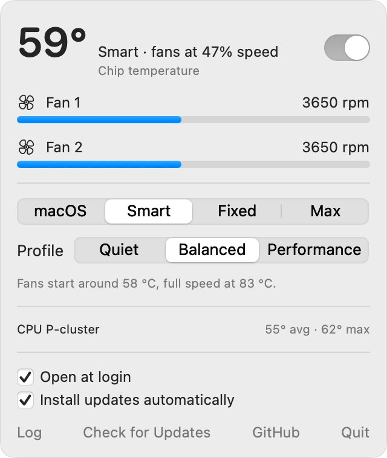
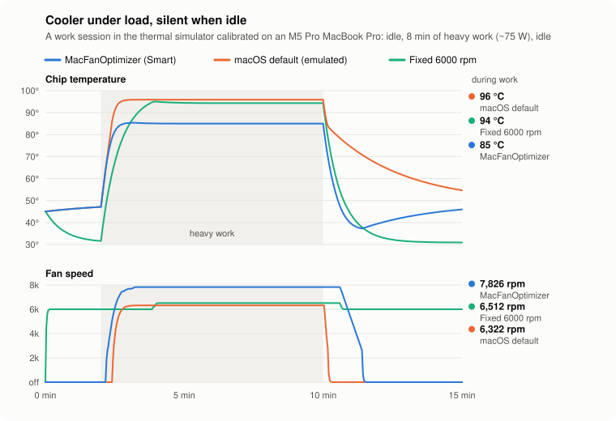

<div align="center">

<h1>MacFanOptimizer</h1>

<p><strong>Free, open-source automatic fan control for Apple Silicon MacBooks.</strong><br/>
A Macs Fan Control alternative: silent when your Mac is cool, full speed when it's hot.</p>

<a href="https://github.com/estevecastells/macfanoptimizer/releases/latest/download/MacFanOptimizer-macos-arm64.zip"></a>
&nbsp;
<a href="https://github.com/estevecastells/macfanoptimizer/releases/latest/download/macfanoptimizer-macos-arm64.tar.gz"></a>

<p>
<a href="https://github.com/estevecastells/macfanoptimizer/releases/latest"></a>
<a href="https://github.com/estevecastells/macfanoptimizer/releases"></a>

<a href="https://github.com/estevecastells/macfanoptimizer/actions/workflows/ci.yml"></a>
<a href="LICENSE"></a>
</p>

**Or install in one line** (no security prompt; verifies checksums):

</div>

```sh
curl -fsSL https://raw.githubusercontent.com/estevecastells/macfanoptimizer/main/scripts/get.sh | bash
```

<div align="center"><sub>
Requires an Apple Silicon Mac on macOS 14+. After downloading, move the app to Applications, open it, and click <b>Install Fan Service…</b> in the menu bar.<br/>
The app isn't notarized yet: on first launch, open <b>System Settings → Privacy &amp; Security</b> and click <b>Open Anyway</b>.
Quit Macs Fan Control before installing. <a href="#install">More install options</a>.
</sub></div>

<br/>

<p align="center">
  <picture>
    <source media="(prefers-color-scheme: dark)" srcset="docs/images/panel-dark.png">
    
  </picture>
</p>

---

MacFanOptimizer watches your chip's temperature and drives the fans for you. It keeps them silent when the Mac is cool, ramps them to full speed when it's working hard, and slows them down calmly afterwards. You don't have to pick a fixed speed or buy a license to get temperature-based control.

| | macOS default | Macs Fan Control (free) | MacFanOptimizer |
|---|---|---|---|
| Automatic, temperature-driven | ✅ late: lets the chip run hot | ❌ constant speeds only (sensor-based is Pro) | ✅ |
| Reaches max fan speed under sustained load | only near throttling | only if you set it manually | ✅ |
| Silent at idle | ✅ | ❌ while a constant speed is set | ✅ hands control back to macOS |
| Open source | ❌ | ❌ | ✅ MIT |
| Resource use | n/a | Qt app | ~1 MB Rust daemon, ~6 MB RAM, ~3 ms of SMC I/O every 2 s |

> Not affiliated with CrystalIDEA (makers of Macs Fan Control) or Apple. Mentioned only for comparison.

## How it works

```
 menu bar app (Swift, runs as you) ──JSON over Unix socket──▶ fand (Rust, root, launchd)
                                                                  │
 fanctl (CLI) ───────────────────────────────────────────────────┘  reads ~118 die sensors,
                                                                     writes fan targets via the SMC
```

Every 2 seconds the daemon:

1. Reads the SoC die temperature sensors. It does a full scan every 10 s and re-reads only the hottest 16 sensors in between, because each SMC read costs about 135 µs on Apple Silicon.
2. Computes the control temperature: the mean of the 4 hottest sensors, smoothed. Rises are followed within about 2 s, falls over about 12 s.
3. Maps it through a fan curve: **fast up, slow down**. Increases apply right away. Decreases wait for 30 s of lower temperatures, then ramp down gently with 3 °C of hysteresis, so bursty workloads don't make the fans hunt.
4. Writes the SMC only when the target moves by at least 50 rpm. If macOS (after sleep) or another app takes the fans back, it re-asserts its target.
5. When the curve reaches 0 %, it **hands the fans back to macOS**, so they can stop completely at idle.

Safety: a hot chip always wins over a fixed speed, sensor failures hand control back to macOS, fans that don't obey within 30 s are handed back too, and the fans are released on exit, crash or uninstall.

### Modes and profiles

| Mode | Behaviour |
|---|---|
| **Smart** (default) | Temperature curve, using the selected profile |
| **Fixed** | Constant RPM, raised automatically if the chip approaches 95 °C |
| **Max** | All fans at full speed |
| **macOS** | Hands off |

| Profile | Fans start | Full speed at |
|---|---|---|
| Quiet | 66 °C | 92 °C |
| Balanced | 58 °C | 83 °C |
| Performance | 50 °C | 76 °C |
| Custom | `custom_curve` in the config file | |

The switch at the top of the menu bar panel turns fan control off (macOS mode) and back on to the mode you last used. Temperatures follow your Celsius/Fahrenheit choice in **System Settings → General → Language & Region**.

### Simulated comparison

<picture>
  <source media="(prefers-color-scheme: dark)" srcset="docs/images/chart-session-dark.svg">
  
</picture>

A work session in the built-in thermal model, which is calibrated against an M5 Pro MacBook Pro: 2 minutes idle, 8 minutes of heavy work, then idle. "macOS default" is an *emulation* of Apple's late-ramping policy, not a measurement. "Fixed 6000 rpm" is our Fixed mode, comparable to a constant speed in Macs Fan Control's free version, except that ours raises the fans when the chip nears 95 °C. Regenerate with `python3 docs/images/make_chart.py`.

| Policy | Chip during work | Fans during work | Fans when idle |
|---|---|---|---|
| **MacFanOptimizer (Smart, Balanced)** | **85 °C** | 7,826 rpm (max) | **off** |
| macOS default (emulated) | 96 °C | 6,322 rpm | off |
| Fixed 6000 rpm (our Fixed mode) | 94 °C | 6,512 rpm (raised by the safety floor) | 6,000 rpm |

## Supported hardware

MacFanOptimizer works out what to do from what your Mac's SMC exposes, not from a list of model names. So it can run on Macs nobody has tested yet, safely.

| Mac | Status |
|---|---|
| MacBook Pro, M5 Pro (`Mac17,9`) | ✅ **Validated**: tested end to end |
| Other Apple Silicon Macs with fans: MacBook Pro (M1–M5), Mac mini, Mac Studio, iMac, Mac Pro | 🟡 **Compatible**: fan control on, verified at runtime |
| MacBook Air (fanless) | 👀 **Monitoring only**: temperatures, nothing to control |
| Intel Macs | ❌ Not supported |

**How untested Macs stay safe:**

- The daemon only takes control if it finds the standard fan keys and at least 4 recognizable chip temperature sensors. Otherwise it's read-only and tells you why.
- After its first write, it checks that the fans actually obey. They must hold the requested speed within 30 seconds. If they don't, it hands the fans back to macOS, stops controlling them, and shows why in the menu bar.
- The usual safety rules still apply: fans are released on exit, crash or sensor failure, and a hot chip always overrides fixed speeds.
- Prefer to keep an unvalidated Mac read-only? Set `control_unvalidated_models = false` in the config.

**Help validate your Mac.** If it works for you (or doesn't), run `fanctl report | pbcopy` and paste it into a [model support issue](https://github.com/estevecastells/macfanoptimizer/issues/new?template=model_support.yml). It's read-only and takes a few seconds. Each report moves a model from 🟡 to ✅. See [docs/HARDWARE.md](docs/HARDWARE.md) for what we know per chip generation.

Requires macOS 14 or later.

## Install

Requires an Apple Silicon Mac on macOS 14 or later. **Quit Macs Fan Control first**, and remove it from your login items. Two fan controllers will fight over the fans; MacFanOptimizer detects that and warns you.

### One-line install (recommended)

```sh
curl -fsSL https://raw.githubusercontent.com/estevecastells/macfanoptimizer/main/scripts/get.sh | bash
```

This downloads the [latest release](https://github.com/estevecastells/macfanoptimizer/releases/latest), verifies its SHA-256 checksums, installs the fan service (asking for your password once), and puts **MacFanOptimizer.app** in Applications. You can [read the script](scripts/get.sh) first.

### Download the app

1. Download `MacFanOptimizer-macos-arm64.zip` from the [latest release](https://github.com/estevecastells/macfanoptimizer/releases/latest), unzip it, and move **MacFanOptimizer.app** to Applications.
2. Open it. The app isn't notarized by Apple yet, so the first time macOS says it can't verify it. Go to **System Settings → Privacy & Security** and click **Open Anyway**.
3. Click the fan icon in the menu bar, then **Install Fan Service…**.

The app opens at login automatically. Untick **Open at login** in its menu to stop that. The fan service itself always runs in the background, with or without the app.

### Command line only

Download `macfanoptimizer-macos-arm64.tar.gz` from the [latest release](https://github.com/estevecastells/macfanoptimizer/releases/latest), then:

```sh
tar -xzf macfanoptimizer-macos-arm64.tar.gz
sudo ./macfanoptimizer/install.sh
```

### From source

You need [Rust](https://rustup.rs) and the Xcode Command Line Tools (`xcode-select --install`). Full Xcode is not required.

```sh
git clone https://github.com/estevecastells/macfanoptimizer
cd macfanoptimizer
make install        # builds, installs the daemon (asks for your password), prints status
make run-app        # builds and opens the menu bar app
```

### Uninstall

```sh
sudo "/Library/Application Support/MacFanOptimizer/uninstall.sh"          # fans go back to macOS
sudo "/Library/Application Support/MacFanOptimizer/uninstall.sh" --purge  # also delete config and logs
```

Then delete MacFanOptimizer.app.

## Command line

```sh
fanctl status                 # temperatures, fans, current decision (add --fahrenheit or --celsius)
fanctl watch                  # live view
fanctl mode smart             # smart | fixed 3500 | max | system
fanctl profile quiet          # quiet | balanced | performance | custom
fanctl config                 # print the active config
fanctl sensors [--all]        # every temperature sensor (no daemon needed)
fanctl probe                  # what the controller sees on this Mac (no daemon needed)
fanctl report                 # hardware report to paste into a GitHub issue
fanctl simulate bursty        # run the controller against the thermal model
fanctl benchmark              # compare policies across scenarios
```

Configuration lives in `/Library/Application Support/MacFanOptimizer/config.toml`. Every tuning knob is documented in [docs/ARCHITECTURE.md](docs/ARCHITECTURE.md). Logs go to `/var/log/macfanoptimizer.log`.

## Development

```sh
make test        # Rust unit, integration and simulator tests + Swift protocol checks
make lint        # rustfmt + clippy -D warnings
make ci          # everything CI runs
```

You can work on everything without root and without touching your fans:

```sh
cargo run -p fand -- --dry-run --socket /tmp/mfo.sock --config /tmp/mfo.toml
MACFANOPTIMIZER_SOCKET=/tmp/mfo.sock build/MacFanOptimizer.app/Contents/MacOS/MacFanOptimizer
```

Repository layout:

| Path | What |
|---|---|
| `crates/smc` | Dependency-free Apple SMC access (IOKit FFI, type codecs) |
| `crates/fan-core` | Pure logic: curves, controller, engine, protocol, thermal simulator |
| `crates/fand` | Root daemon: SMC backend, socket server, launchd integration |
| `crates/fanctl` | CLI |
| `app/` | SwiftUI menu bar app (SwiftPM, no Xcode project) |
| `fixtures/` | Wire-protocol samples shared by the Rust and Swift tests |
| `scripts/` | Install, uninstall, app bundling |

Contributions are welcome. Read [CONTRIBUTING.md](CONTRIBUTING.md) first. Pull requests are reviewed once a week.

## License

[MIT](LICENSE)
